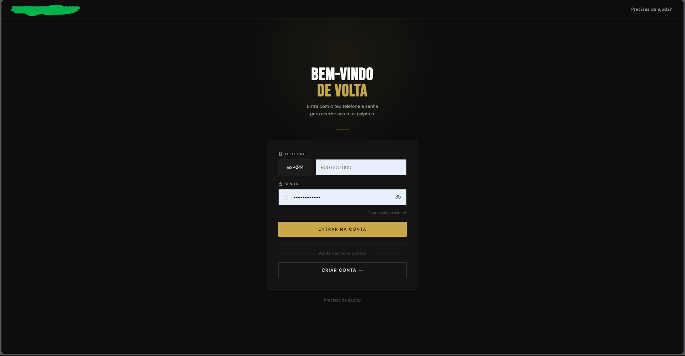
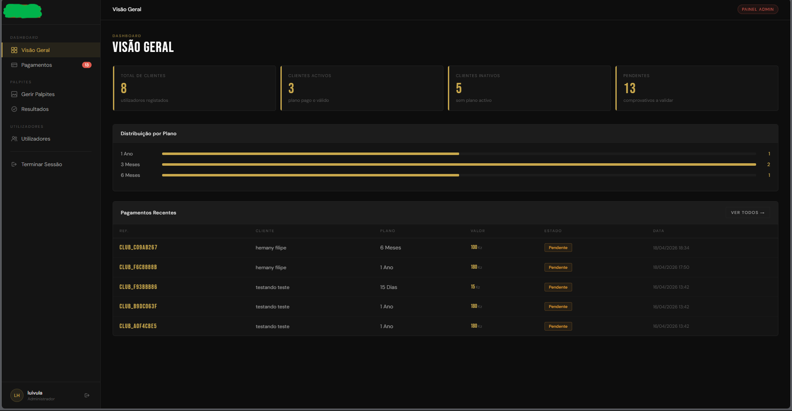

# Sistema de Prognósticos de Futebol (Case Study)

> **Projeto desenvolvido sob demanda para cliente real, após análise de um repositório público anterior desenvolvido por mim.**

---

## Visão Geral

Este sistema foi desenvolvido após uma empresa identificar um dos meus projetos no GitHub e solicitar uma solução personalizada baseada naquele conceito.

A partir dessa oportunidade, foi criada uma plataforma completa para gestão e visualização de prognósticos de futebol, com foco em:

* Escalabilidade
* Segurança
* Experiência do usuário
* Controle de acesso

---

##  Contexto do Projeto

A empresa teve contato com um repositório anterior desenvolvido por mim, disponível em:

👉 https://github.com/hemany404/Sistema-Prognostico-Futebol

Com base nesse projeto inicial, fui contratado para:

* Evoluir a ideia para um sistema mais robusto
* Adaptar funcionalidades para uso real em ambiente empresarial
* Criar uma solução completa com autenticação,assinaturas e painel administrativo

---

##  Problema

A empresa precisava de uma forma eficiente de:

* Gerenciar prognósticos de forma centralizada
* Controlar as assinaturas
* Controlar acesso de usuários por nível
* Separar previsões futuras de resultados passados
* Oferecer uma experiência profissional para clientes

---

##  Solução Desenvolvida

Foi desenvolvida uma plataforma web completa com:

* Sistema de autenticação 
* Sistema de Assinaturas
* Notificações automáticas
* Painel administrativo privado
* Área do cliente com acesso controlado
* Organização de prognósticos 
* Interface rápida e responsiva

---

##  Demonstração

###  Tela de Login

###  Dashboard do Administrador

###  Área do Cliente

###  Lista de Prognósticos

---

##  Tecnologias Utilizadas

* Python
* FastAPI
* html/CSS
* JavaScript
* SQLAlchemy
* PostgreSQL
* JWT Authentication
* Supabase Storage
* Resend

---

##  Arquitetura do Sistema

O sistema foi estruturado com foco em boas práticas modernas:

* Separação entre frontend e backend
* API protegida com autenticação
* Middleware para controle de acesso
* Uso de ORM para gestão de dados

---

## Segurança

* Proteção de rotas
* Controle de permissões por tipo de usuário
* Autenticação via JWT
* Validação de dados no backend

---

## Tipos de Usuário

###  Administrador

* Gerenciar prognósticos
* Gerenciar usuários
* Aprovar pagamentos 
* Autorizar usuarios após o comprovativo ser aprovado
* Acesso total ao sistema

###  Cliente

* Visualizar prognósticos conforme seu nível
* Acompanhar previsões e histórico

---

##  Resultado

* Transformação de um projeto pessoal em solução empresarial
* Validação prática do meu trabalho através de contratação real
* Base pronta para evolução futura como produto digital

